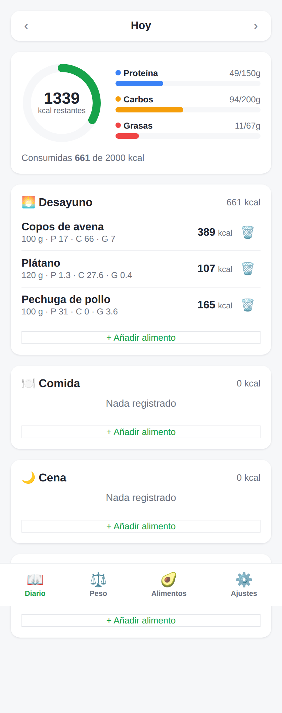

# 🥑 FooDiary

App tipo **MyFitnessPal** para el seguimiento de **peso**, **diario de comidas** y
**composición de macros** (calorías, proteínas, carbohidratos y grasas).

100 % local: todos tus datos se guardan en tu propio navegador (`localStorage`).
Sin cuentas, sin servidores y sin conexión necesaria.



## Funciones

- **📖 Diario de comidas** — registra alimentos en desayuno, comida, cena y snacks;
  anillo de calorías restantes y barras de progreso de macros frente a tus objetivos.
  Toca cualquier alimento del diario para **editar la cantidad** (recalcula kcal y macros).
- **⚖️ Peso** — registra tu peso por día, gráfico de evolución (30 / 90 días / 1 año / todo),
  línea de meta, variación desde el inicio, distancia al objetivo e IMC.
- **🥑 Alimentos** — base de datos de alimentos habituales **clasificados por cocción**
  (crudo, cocido, plancha, horno, frito, vapor, natural), con filtro por método y
  variantes crudo/cocido donde los macros cambian (arroz, pasta, legumbres, carnes,
  milanesas…). Buscas (sin importar acentos), eliges la cantidad en gramos y ves al
  momento calorías y macros. También puedes crear alimentos propios (con marca, porción
  y cocción) reutilizables.
- **🏷️ Productos de marca** — productos de marca incluidos (La Serenísima, Ser, Sancor,
  Mendicrim…) y una pestaña **"Marcas (online)"** que busca en
  [Open Food Facts](https://world.openfoodfacts.org) (requiere conexión; degrada con
  aviso si la red no está disponible). Los productos elegidos online se guardan en
  "Mis alimentos" para reutilizarlos.
- **🎯 Calculadora de objetivos** — a partir de sexo, edad, altura, peso actual,
  peso objetivo, nivel de actividad y plazo, estima tus **calorías diarias** y el
  **reparto de macros** (Mifflin-St Jeor + TDEE) y lo aplica como tus objetivos.
- **⚙️ Ajustes** — objetivos diarios de calorías y macros (con presets 40/30/30),
  perfil (altura, peso objetivo) y **exportar / importar / borrar** tus datos en JSON.

## Stack

- [React 18](https://react.dev/) + [TypeScript](https://www.typescriptlang.org/)
- [Vite](https://vitejs.dev/) como bundler y dev server
- [React Router](https://reactrouter.com/) (hash routing) para la navegación
- [Recharts](https://recharts.org/) para el gráfico de peso
- Persistencia en `localStorage` (sin backend)

## Empezar

```bash
npm install
npm run dev      # servidor de desarrollo (http://localhost:5173)
```

Otros scripts:

```bash
npm run build    # comprobación de tipos + build de producción en dist/
npm run preview  # sirve el build de producción
npm run lint     # solo comprobación de tipos (tsc --noEmit)
```

## Estructura

```
src/
├── lib/
│   ├── types.ts          # tipos de dominio
│   ├── foodDatabase.ts   # base de alimentos incluida
│   ├── store.tsx         # estado global + persistencia en localStorage
│   └── utils.ts          # fechas, cálculo de macros, helpers
├── components/           # CalorieRing, MacroBar, DateNav, AddFoodModal
├── pages/                # DiaryPage, WeightPage, FoodsPage, SettingsPage
├── App.tsx               # rutas + barra de navegación inferior
└── main.tsx              # punto de entrada
```

## Notas

- Los valores nutricionales de la base de datos incluida son **aproximados** (por 100 g)
  y sirven como punto de partida; puedes crear alimentos propios con tus propios valores.
- Al ser local, para pasar tus datos a otro dispositivo usa **Ajustes → Exportar** y
  luego **Importar** el archivo `.json`.

## Ideas para ampliar

- Sincronización con backend y cuentas de usuario.
- Búsqueda de alimentos por código de barras / API nutricional.
- Recetas y comidas favoritas para añadir de una vez.
- Objetivos calculados automáticamente (TMB + actividad).
